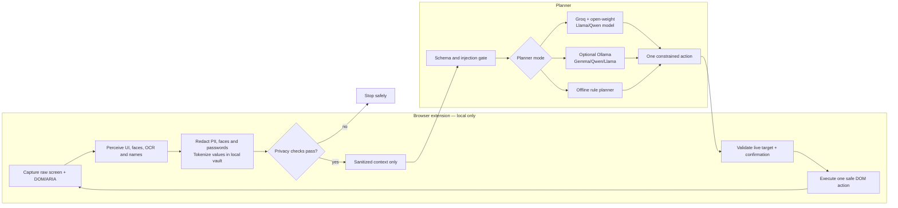

# Nayan

> Privacy-preserving on-device visual perception for lightweight browser agents.

Nayan is a runnable browser extension, local privacy pipeline, FastAPI planner, and evaluation dashboard. It helps an agent act on a real browser page without sending raw screens, raw DOM, plaintext PII, passwords, or token-vault values to its planner. The included synthetic portal remains a regression fixture, not the recommended presentation demo.

## Privacy-first architecture



Raw screenshots, DOM/HTML, OCR text, plaintext PII, passwords, and token-vault values stay local. Only the sanitized context can cross the privacy boundary. The browser rechecks every action against the live page and asks before send, submit, delete, pay, or other consequential actions.

## Included core

- WXT Manifest V3 extension with Chrome and Firefox build targets.
- Local capture, DOM/ARIA extraction, scene fusion, and recapture loop.
- Local MobileNetV3 GUI classification, UltraFace face detection, canvas-only Tesseract OCR, and optional quantized TinyBERT named-entity recognition through Transformers.js.
- PII recognition for email, phone, card (Luhn), PAN, Aadhaar (Verhoeff), IP, DOB, and bank account, plus deterministic DOM field rules.
- Task-scoped local token vault: the planner sees `<EMAIL_…>`, never the source email.
- Separate sanitized-output construction, pixel masking/face blur, redaction verification, and a key/value payload guard.
- FastAPI schema gate, injection-aware context builder, offline rule planner, Groq-hosted open-weight planner support, and server action validation.
- Browser action validation, confirmation-gated submit flow, safe DOM actions, payload inspector, and real-application demo guidance.
- Generated benchmark results and judge-facing dashboard.

## AI components

| Component | Purpose | Source |
| --- | --- | --- |
| MobileNetV3 ONNX | Locally classifies likely UI regions. | [MobileNetV3](https://arxiv.org/abs/1905.02244) model family |
| Visual region proposer | Finds visually distinct screenshot regions before classification. | Nayan's lightweight local computer-vision logic (not an external AI model) |
| UltraFace RFB-320 | Detects faces locally for blur redaction. | [Ultra-Light Face Detector](https://github.com/Linzaer/Ultra-Light-Fast-Generic-Face-Detector-1MB) |
| TinyBERT NER | Detects person names and replaces them with local placeholders. | [TinyBERT NER ONNX](https://huggingface.co/onnx-community/TinyBERT-finetuned-NER-ONNX) |
| Transformers.js + ONNX Runtime Web | Runs local models in-browser, preferring WebGPU with WASM fallback. | [Transformers.js](https://github.com/huggingface/transformers.js) and ONNX Runtime Web |
| Tesseract OCR | Reads eligible image/canvas text locally. | Tesseract.js |
| Open-weight planner | Reasons from sanitized context only in connected mode. | [Groq API](https://console.groq.com/docs/api-reference) hosting a Llama- or Qwen-family model |
| Local planner (roadmap) | Keeps even sanitized context on the device or local network. | Gemma, Qwen, or Llama through Ollama |

No AI provider receives the raw page, raw screenshot, or plaintext PII.

## Repository layout

```text
extension/                 WXT extension and local privacy pipeline
server/                    FastAPI planning gateway
shared/schemas/            Strict protocol schemas
shared/policy/             Versioned redaction policy
shared/eval/               Labelled fixtures and generated benchmark result
demo/mock-portal/          Synthetic reimbursement scenario
demo/benchmark-dashboard/  Local evaluation dashboard
docs/                      Architecture, safety, demo, compatibility
scripts/                   Benchmark harness
```

## Quick start

Requirements: Node.js 20+, Python 3.13 recommended, Chrome/Chromium for the primary demo.

```bash
git clone https://github.com/praju455/Nayan.git
cd Nayan
npm install

cd server
python3.13 -m venv .venv
.venv/bin/pip install -r requirements.txt
cd ..
```

Start the server:

```bash
cd server && .venv/bin/uvicorn app.main:app --reload --port 8000
```

Build the extension:

```bash
npm run build --workspace=@nayan/extension
```

To include the optional local NER model for person-name detection, prepare it before building:

```bash
npm run prepare:ner --workspace=@nayan/extension
```

This command downloads the reviewed, quantized ONNX model into ignored local build assets. At runtime the extension disables remote model access; if the model is absent or unavailable, deterministic PII and DOM rules still run locally and Nayan never uploads page text as a fallback.

Open `chrome://extensions`, enable Developer mode, choose **Load unpacked**, and select `extension/.output/chrome-mv3`. For the recommended demo, open a real browser application in a test account, approve that site in Nayan, and run a low-risk task such as opening a Gmail draft or scrolling a public GitHub page. See [the real-application demo script](docs/demo-script.md). The synthetic portal can still be started with `npm run dev --workspace=@nayan/mock-portal` for offline regression testing.

For Firefox:

```bash
npm exec --workspace=@nayan/extension wxt build -- --browser firefox
```

Load `extension/.output/firefox-mv2` as a temporary add-on. See [browser compatibility](docs/browser-compatibility.md).

## Verify and evaluate

```bash
npm run test
npm run lint
cd server && .venv/bin/pytest -q
cd .. && npm run evaluate
npm run dev --workspace=@nayan/benchmark-dashboard
```

The dashboard reads `shared/eval/results/latest.json`, generated by `npm run evaluate`. The results come from labelled synthetic fixtures, not hard-coded display constants and not a claim about real-world accuracy.

### Benchmark plan

| Need | Dataset | Use in Nayan |
| --- | --- | --- |
| Text PII | [AI4Privacy PII Masking 300k](https://huggingface.co/datasets/ai4privacy/pii-masking-300k) | Evaluate PII span detection and placeholder masking. |
| Face redaction | [WIDER FACE](https://mmlab.ie.cuhk.edu.hk/projects/WIDERFace/) | Measure face-detection recall and blur/redaction coverage. |
| Screenshot UI grounding | [GroundCUA](https://github.com/ServiceNow/GroundCUA) | Evaluate finding the intended field or button in a screenshot. |
| End-to-end browser tasks | [OSWorld](https://github.com/xlang-ai/OSWorld) | Evaluate perceive → sanitize → plan → act workflows. |

These datasets are needed for the next validation phase; the current synthetic fixtures are not enough to claim real-world accuracy. Start with 2,000 held-out AI4Privacy samples, 500 WIDER FACE validation images, 300 GroundCUA screenshots/actions, and 50–100 controlled real-web captures from test accounts. Keep raw captures local; commit only sanitized examples, annotations, and aggregate metrics. Check each dataset licence before use or redistribution.

## Planner modes

The default deterministic `rule` backend runs the offline regression fixture without credentials. Connected mode uses Groq with an **open-weight**, offline-deployable model such as a Llama or Qwen family model:

```bash
NAYAN_REASONING_BACKEND=groq
GROQ_API_KEY=your-key
NAYAN_GROQ_MODEL=llama-3.3-70b-versatile
```

The server sends only its already-sanitized reasoning context to Groq. A malformed response or invalid action stops the task rather than bypassing validation. The planner must return one action matching `shared/schemas/action-response.schema.json`; the server and browser each validate it before execution. Record the exact model name, source, version, licence, and API configuration used in the final demo.

The planned sovereign mode uses an open-weight Gemma, Qwen, or Llama model through Ollama on `localhost` or an approved local network. It is not yet wired into the runtime. The repository still contains a transitional Gemini adapter from an earlier prototype; it is not part of the target architecture. Copy `server/.env.example` to a local ignored `.env` only if your launch setup loads environment files; never place keys in the extension.

## Never transmitted

- Raw screenshots, visible-tab frames, DOM/HTML, OCR, or unredacted canvas/image crops.
- Unsanitized task text, plaintext PII, passwords, vault mappings, or token values.
- Arbitrary JavaScript, shell commands, or unvalidated actions.

The payload guard rejects both forbidden key names and PII under innocuous-looking values. Deliberate raw-artifact and plaintext-PII injections are regression tests.

## Models and honest limits

The extension packages local GUI-classification, face-detection, ONNX WASM, and English OCR assets. The optional NER asset uses Transformers.js with WebGPU first and local WASM fallback. WASM is the verified cross-browser baseline; DOM/ARIA semantic mode is the safe fallback if a model fails. Review the model's upstream licence before redistributing a packaged build.

The included planner is deterministic unless Groq is configured. Hosted reasoning must be configured and evaluated for the target domain, and the production configuration must use an open-weight model. The GUI classifier complements DOM identity rather than replacing a dedicated pixel-only GUI detector. OCR and face detection need target-domain evaluation before deployment. Nayan is a technical prototype, not a compliance certification or a defence against a compromised browser.

## Project roadmap

### Done

- Chrome/Firefox extension, local screenshot and DOM/ARIA perception, and WebGPU-first/WASM-fallback inference.
- Local PII and face protection: passwords are blacked out, faces are blurred, and PII is replaced with task-scoped placeholders before the privacy boundary.
- Strict FastAPI schema gate, Groq open-weight-planner support from sanitized context, and browser-side live-target/action validation.
- Confirmation gates for consequential actions such as send, submit, delete, and pay; visual-only regions are never executable.
- Reproducible synthetic regression evaluation and dashboard for grounding, PII, redaction, package size, and local scan latency.
- A real-application demo path using a test Gmail account or public GitHub/docs page; the mock portal is only an offline regression fixture.

### Next steps

- Record the exact source URL, version, licence, and checksum for packaged MobileNetV3 and UltraFace binaries.
- Use an exact open-weight Groq model in the live demo, remove the transitional Gemini adapter, and add the optional Ollama sovereign mode.
- Build the labelled real-world benchmark set for screenshots, PII, faces, and UI grounding using the datasets above plus test-account captures.
- Measure latency and resource use on the judging laptop, improve the visual detector toward a dedicated OmniParser-style UI detector, and test on Chrome and Firefox devices.

## Documentation

- Architecture and benchmark plan: this README
- [Architecture decisions](docs/architecture-decisions.md)
- [Privacy boundary](docs/privacy-boundary.md)
- [Threat model](docs/threat-model.md)
- [Evaluation](docs/evaluation.md)
- [Browser compatibility](docs/browser-compatibility.md)
- [Demo script](docs/demo-script.md)
- [Advanced roadmap](docs/future-wow-roadmap.md)

## Contribution standard

Privacy failure means task failure—never a bypass. Add labelled synthetic fixtures for recognizer/model changes, rerun benchmarks, and never log page content or vault values.
