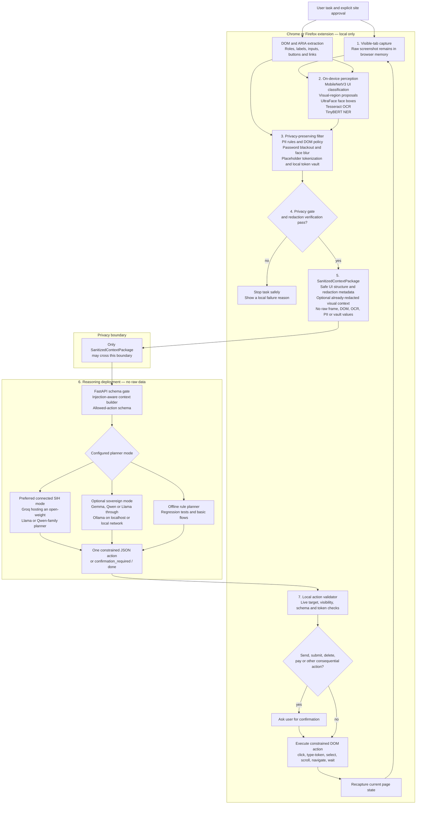

# Architecture

## SIH target architecture

Nayan is a privacy-preserving browser agent, not only a redaction extension. It reads and protects the current page **locally**, sends only an approved sanitized representation to a reasoning backend, then validates and executes one safe browser action locally.

## Non-negotiable privacy invariants

- Raw screenshots, DOM/HTML, OCR text, plaintext PII, passwords, and token-vault mappings stay local.
- The server/planner receives only `SanitizedContextPackage`: safe structure, placeholders, redaction metadata, and optionally an already-redacted visual artifact.
- A planner can return only a closed action enum; it cannot return JavaScript, shell commands, or arbitrary selectors.
- The extension is the final authority: it rechecks the live page, resolves placeholder values locally, and requires confirmation for consequential actions.
- If perception, redaction, schema validation, action validation, or confirmation fails, the task stops rather than bypassing privacy controls.

## Planner policy

For the official SIH deployment, the connected planner must be an **open-weight model hosted by a provider such as Groq** (for example, a Llama or Qwen family model). This satisfies the requirement that the model be offline-deployable even when a cloud-hosted version is used during the event.

The same planner interface also supports a future sovereign deployment with an open-weight Gemma, Qwen, or Llama model running through Ollama on `localhost` or an approved local network. In that mode, even sanitized context does not leave the team's infrastructure. The deterministic rule planner remains an offline development fallback.

The current repository contains a Gemini adapter from an earlier prototype iteration. It is **not part of this official SIH target architecture** because Gemini is proprietary and cannot be self-hosted. It must not be selected for the submission demo; the planner integration should be migrated to an open-weight-only configuration before final submission.

## Local perception details

DOM/ARIA is preferred for exact web-control identity. Local visual inference adds grounding for canvas, images, and non-semantic visual content; inability to run a model never permits raw-upload fallback. The browser tries WebGPU first and then packaged WASM. `env.allowRemoteModels` is disabled for TinyBERT NER, so missing local model files cannot trigger a download or raw-text upload.

Visual-only regions can improve layout understanding but are never executable. Only a currently present DOM/ARIA target can be acted on after local validation.
